# 第一章 数据库系统引论

## 数据库的基本概念

数据库: Models real-world enterprise：

- Entities: 实体
- Relationships: 关系
  
DBMS 功能

- 故障恢复
- 并发访问控制
- 提供高级的用户接口
- 数据目录管理
- 完整性约束检查
- 查询处理和优化

DBMS 的实现包含了计算机技术发展的绝大部分成果.

数据库包含了:  

- 数据模型(数据结构, 描述现实世界的一种方法) 。
- 数据模式(用一个给定的数据模型来描述特定数据产生的结果)
- 数据

## 数据的三级模式和二级数据独立性

1. 应用最广的数据库是关系型数据库, 只包含一种数据结构: Table。 一行称为一元组, 一列称为一属性.对表结构的描述就是它的数据模式。

2. 数据的三级模式
   1. 物理模式 Physical schema：描述了数据在磁盘上的存储形式
   2. 逻辑（概念）模式 Conceptual schema：定义表结构，表的属性
   3. 视图（外）模式 External schema：给最终用户看的，不同用户的视图可能不同

3. 数据独立性
   - 逻辑独立性：应用程序基于外模式开发，不会因为数据库的逻辑模式发生改变而影响到应用程序，只需要保证数据库提供的视图不发生变化。

   - 物理独立性：数据物理结构发生变化时，基于该数据库开发的应用程序不应该受影响。  

4. 这两种独立性是使用 DBMS 的最大好处。

## 数据的发展历史和分类

早期是集中式的数据库系统。之后由于多核CPU的出现，并行计算能力提升，为了充分利用它的处理能力，DBMS提出了并行数据库系统。

无线通信技术的发展提出了移动式数据库。从集中式结构的数据库，到分布式数据库，数据变得分散，主机通过网络连接，主机之间地位平等。

关系数据模型的提出，实体数据全部用表来表示。封闭空间，用数学的方法来研究它。取代了层次和网状数据模型。为了弥补关系模型的不足，先后提出面向对象，E-R数据模型。

第一代数据库系统20世纪70年代 层次和网状数据库系统第二代数据库系统关系数据库系统第三代数据库系统面向对象数据模型数据库技术和其他学科内容相结合（分布式数据库、工程数据库、演绎数据库、知识数据库、时态数据库、空间数据库）

## 数据库系统事务组成和生命周期

第一代数据库系统20世纪70年代：层次和网状数据库系统  
第二代数据库系统：关系数据库系统  
第三代数据库系统：

- 面向对象数据模型
- 数据库技术和其他学科内容相结合（分布式数据库、工程数据库、演绎数据库、知识数据库、时态数据库、空间数据库）  

Internet时代的数据库技术

- Internet技术的发展促进新的数据库应用，诸如支持高层决策的数据仓库、OLAP分析、数据挖掘、电子商务等。
- 出现了Web信息检索技术与系统、Web数据集成与共享技术与系统、数据流技术与系统等具有Internet时代特征的数据库技术和数据库管理系统。

**Database System： DBMS+DBA+Database+Applications.** 其中 DBMS 是核心。

数据库系统的生命周期：规划阶段，数据库设计，数据库建立，数据库运行管理维护，数据库扩展或重构。

# 数据模型

## 层次数据模型

基本：PCR 关系（一对多）Parent-Child relationship 。

层次型数据库的数据模式：

两个个体之间不一定只有上下层次关系。 为了解决这种问题, 引入虚记录。
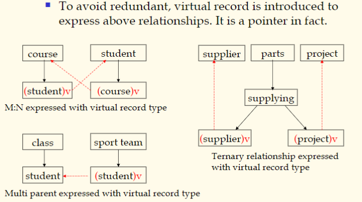

在层次型数据库中做查询就是遍历树。

## 网状数据模型 Network Data Model

基本数据结构叫做 set。 一个 set 表达了显示世界中一对多的关系。指向关系称为记录 Record。指向别的 set 称为主记录, 被指向的称为属记录. 多个 set 交织成网状结构.
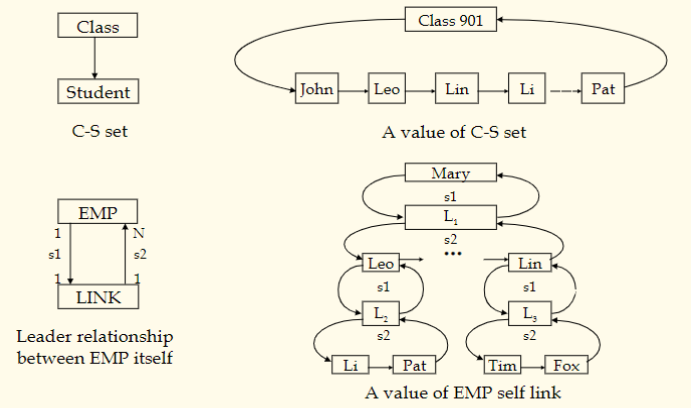

沿着一个属性的属记录一直走, 路线上的元素都包含该属性。  
引入 LINK 记录通过 $s_1$ 和 $s_2$ 表达 EMP 的自连接。

在网状数据库中做查询就是遍历链表。

网状记录的多对多关系表示:
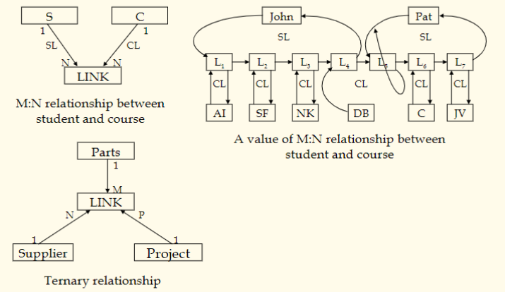

## 关系数据模型 Relational Data Model

### 基本概念和定义

全部关系都只用表来表示。  

特点：

1. Based on set theory, high abstract level
2. Shield all lower details, simple and clear, easy to understand
3. Can establish new algebra system——relational algebra
4. Non procedure query language——SQL
5. Soft link——the essential difference with former data models

Soft Link 软连接：表达多对多的关系，与网状的指针关系不同
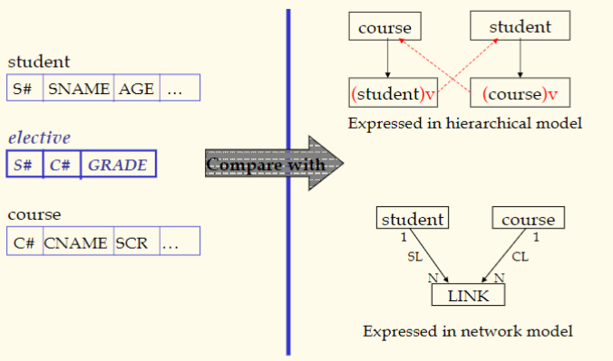

关系模型中不能出现表中套表。

**属性和域**
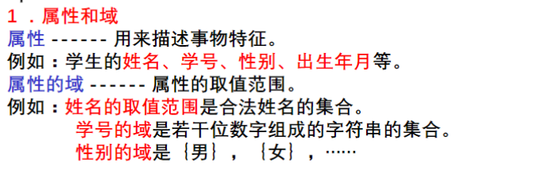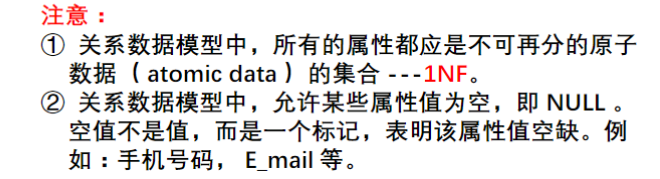
**关系和元组**
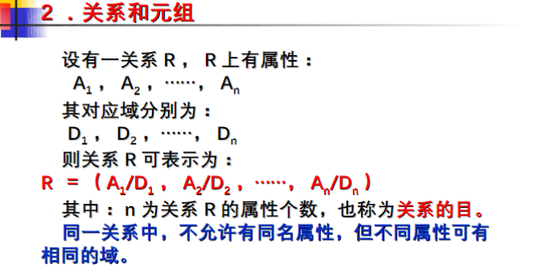
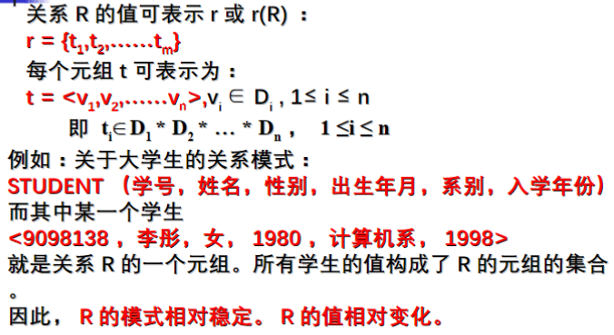
**键**
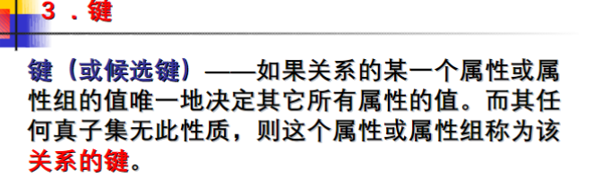
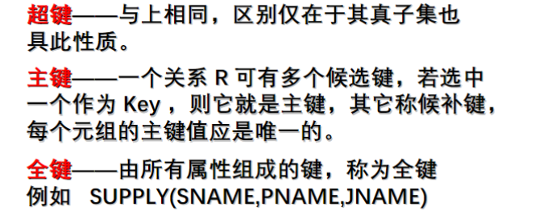
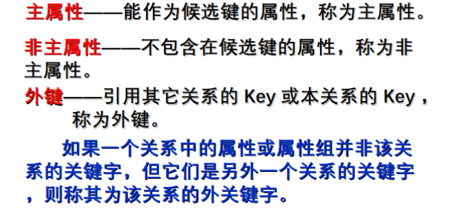
**外键其实就是逻辑指针。**

### 约束

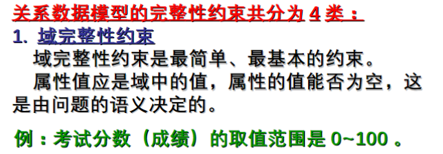
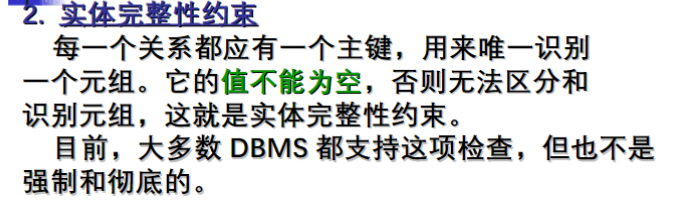
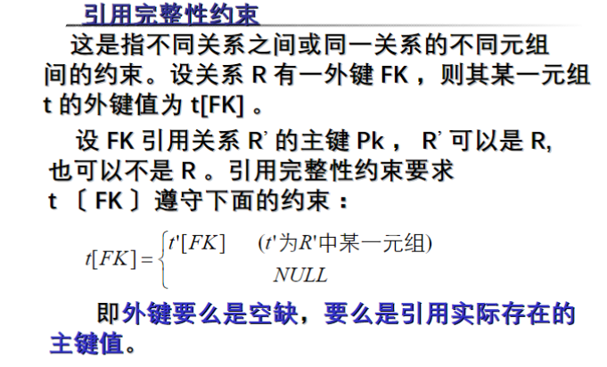
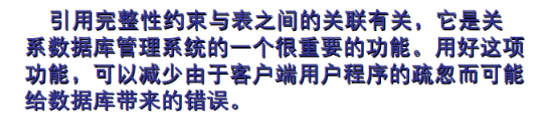
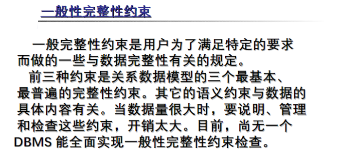

## 关系代数

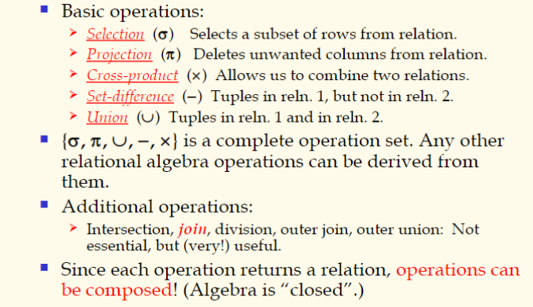

### 关系代数的基本操作

#### Projection 投影 $\pi$

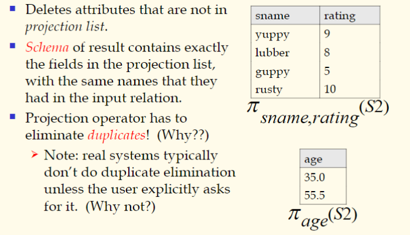
数据库一般不会自动消除投影结果相同的元素, 除非用户显式的要求.

#### Selection 选择 $\sigma$

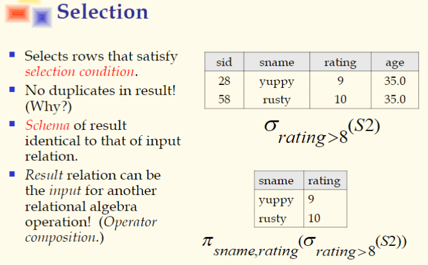
选择操作不会产生重复元组.  
