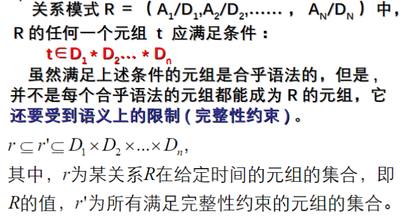

# 第一章 数据库系统引论

## 数据库的基本概念

数据库: Models real-world enterprise：

- Entities: 实体
- Relationships: 关系
  
DBMS 功能

- 故障恢复
- 并发访问控制
- 提供高级的用户接口
- 数据目录管理
- 完整性约束检查
- 查询处理和优化

DBMS 的实现包含了计算机技术发展的绝大部分成果.

数据库包含了:  

- 数据模型(数据结构, 描述现实世界的一种方法) 。
- 数据模式(用一个给定的数据模型来描述特定数据产生的结果)
- 数据

## 数据的三级模式和二级数据独立性

1. 应用最广的数据库是关系型数据库, 只包含一种数据结构: Table。 一行称为一元组, 一列称为一属性.对表结构的描述就是它的数据模式。

2. 数据的三级模式
   1. 物理模式 Physical schema：描述了数据在磁盘上的存储形式
   2. 逻辑（概念）模式 Conceptual schema：定义表结构，表的属性
   3. 视图（外）模式 External schema：给最终用户看的，不同用户的视图可能不同

3. 数据独立性
   - 逻辑独立性：应用程序基于外模式开发，不会因为数据库的逻辑模式发生改变而影响到应用程序，只需要保证数据库提供的视图不发生变化。

   - 物理独立性：数据物理结构发生变化时，基于该数据库开发的应用程序不应该受影响。  

4. 这两种独立性是使用 DBMS 的最大好处。

## 数据的发展历史和分类

早期是集中式的数据库系统。之后由于多核CPU的出现，并行计算能力提升，为了充分利用它的处理能力，DBMS提出了并行数据库系统。

无线通信技术的发展提出了移动式数据库。从集中式结构的数据库，到分布式数据库，数据变得分散，主机通过网络连接，主机之间地位平等。

关系数据模型的提出，实体数据全部用表来表示。封闭空间，用数学的方法来研究它。取代了层次和网状数据模型。为了弥补关系模型的不足，先后提出面向对象，E-R数据模型。

第一代数据库系统20世纪70年代 层次和网状数据库系统第二代数据库系统关系数据库系统第三代数据库系统面向对象数据模型数据库技术和其他学科内容相结合（分布式数据库、工程数据库、演绎数据库、知识数据库、时态数据库、空间数据库）

## 数据库系统事务组成和生命周期

第一代数据库系统20世纪70年代：层次和网状数据库系统  
第二代数据库系统：关系数据库系统  
第三代数据库系统：

- 面向对象数据模型
- 数据库技术和其他学科内容相结合（分布式数据库、工程数据库、演绎数据库、知识数据库、时态数据库、空间数据库）  

Internet时代的数据库技术

- Internet技术的发展促进新的数据库应用，诸如支持高层决策的数据仓库、OLAP分析、数据挖掘、电子商务等。
- 出现了Web信息检索技术与系统、Web数据集成与共享技术与系统、数据流技术与系统等具有Internet时代特征的数据库技术和数据库管理系统。

**Database System： DBMS+DBA+Database+Applications.** 其中 DBMS 是核心。

数据库系统的生命周期：规划阶段，数据库设计，数据库建立，数据库运行管理维护，数据库扩展或重构。

# 数据模型

## 层次数据模型

基本：PCR 关系（一对多）Parent-Child relationship 。

层次型数据库的数据模式：  
  

两个个体之间不一定只有上下层次关系。 为了解决这种问题, 引入虚记录。  
  

在层次型数据库中做查询就是遍历树。

## 网状数据模型 Network Data Model

基本数据结构叫做 set。 一个 set 表达了显示世界中一对多的关系。指向关系称为记录 Record。指向别的 set 称为主记录, 被指向的称为属记录.多个 set 交织成网状结构.  
  

沿着一个属性的属记录一直走, 路线上的元素都包含该属性。  
引入 LINK 记录通过 $s_1$ 和 $s_2$ 表达 EMP 的自连接。

在网状数据库中做查询就是遍历链表。

网状记录的多对多关系表示:  
  

## 关系数据模型 Relational Data Model

### 基本概念和定义

全部关系都只用表来表示。  

特点：

1. Based on set theory, high abstract level
2. Shield all lower details, simple and clear, easy to understand
3. Can establish new algebra system——relational algebra
4. Non procedure query language——SQL
5. Soft link——the essential difference with former data models

Soft Link 软连接：表达多对多的关系，与网状的指针关系不同
  

关系模型中不能出现表中套表。

**属性和域**
  
  
**关系和元组**
  
  
**键**
  
  
  
**外键其实就是逻辑指针。**

### 约束

  
  
  
  
  
  

## 关系代数

  

### 关系代数的基本操作

#### Projection 投影 $\pi$

  
数据库一般不会自动消除投影结果相同的元素, 除非用户显式的要求.

#### Selection 选择 $\sigma$

  
选择操作会消除重复元组 .  

#### 并交差

  
参与并交差的表必须具有相同的属性, 属性个数相同, 属性类型相同.

### 关系代数的连接操作 Joins

笛卡尔乘积 Cross Product: 将两张不同的表做笛卡尔乘积就是将两张表并成大表. 两张表的每条属性两两拼接.  
**连接操作:**  
条件连接 Condition Join: 与在笛卡尔乘积的基础上做条件选择的结果相同.  
等值连接 Equi-join: 条件连接的条件全部是等于条件, 则为条件连接.  
自然连接 Natural-join: 两张表在所有的公共属性上都做等值连接.  

### 关系代数除法

查找所有...的操作需要除法.  
  
$A/B$表示在关系 B 中任意一个 y值, 在A中都有与之对应的 x值 组成的集合.  
例如:
  
以 B2 为例, sno 表中每个 sno 都必须有 p2和p4 有联系.  
怎样用5个基本操作来实现除法操作:
  
为了计算 $A/B$, 计算所有 x 值, 它不满足
正向思考是: 与x满足除法条件的y的集合与B集合相同(就是B集合).
逆向思考(排除法): 全集-不满足除法条件的集合.假如与x产生联系的y不是全集, 那么这个x就不属于A结果集, 将这些x放入不满足除法条件的集合Y. 最后结果集就是 全集-Y.  
$\pi_x(A)$ : A中x构成的集合.  
$\pi_x(A)\times B$ : A中所有的x与B进行表连接.  
$\pi_x(A)\times B-A$ : 所有不满足除法条件的x,y构成的表. 满足除法条件的x与y都是有拼接的. 两个相减会把所有满足除法条件的x一次减光. 剩下来的就是不满足除法条件的x和某些y值得拼接.  
$A/B=\pi_x(A)-\pi_x(\pi_x(A)\times B-A)$: 最后 A中的x减去不满足条件的集合得到的就就是满足除法条件的集合.  

### 外连接 Outer Join

  
连接操作中, A表记录无法在B表中找到一个匹配的自然连接的表记录, 但是我们想要将A表中的该表记录保留下来, 这时候就需要使用到外连接.  
分为左外连接,右外连接,全连接. 左外连接时, 左边表记录在右边找不到匹配记录, 就在右边补空值, 右外连接同理.  

### 外并 Outer Union

  
把两个不满足并兼容的关系强行合并在一起. 结果的属性是参与运算的两个关系的并, 缺失属性的补空值.  

## 关系演算

  

在关系代数中, 是一种过程化的表达. 关系演算表达能力和关系演算相同, 但是表达过程不是过程化的，基于谓词逻辑, **SQL就是基于关系演算的．**只需要描述结果应该满足什么样的条件就行了.  
元组关系演算TRC，域关系演算DRC. 两个的区别是变量定义单位,元组关系演算变量定义在元组上,域关系演算变量定义在属性上.  

  
安全演算: 查询结果是无限的, 这种查询是没有意义的.  
表达能力: 关系代数可以表达的查询关系用安全的关系演算都能表达.  

## 对传统模型的评价

传统数据模型有层次数据模型、网状数据模型、关系数据模型、关系数据模型。
特点：

- 都继承了文件中的记录、字段等概念。都继承了文件中的记录、字段等概念。
- 物理级也借鉴了文件的索引、散列等存取方法。物理级也借鉴了文件的索引、散列等存取方法。
- 向用户提供了统一的数据模型和相应的数据库语言。
- 都在记录的基础上定义了数据的基本结构、约束和操作都在记录的基础上定义了数据的基本结构、约束。

传统数据模型的不足：

- 以记录为基础，不能很好地面向用户和应用。记录和实体不一定相对应。
- 不能以自然的方式表示实体间联系。
- 语义贫乏。
- 数据类型少，难以满足应用需要。

## E-R 数据模型

E-R 数据模型:

1. 实体: Real-world object.
2. Entity Set: 实体集合.
   - 一个实体集里面的所有实体都具有相同的属性. 每一个实体有一个 key. 允许复合类型, 多值属性, 这一点与关系模型不同.  
3. 联系 Relationship: 实体之间的集合.
   - 联系可以拥有属性
4. Relationship set: 联系集合
   - 一个 n-ary relationship set可以与 n 个 entity 产生联系.
   - 同一个 Entity set可以在不同的 Relationship set 中充当不同的角色.

E-R 模型图 ER Diagram
  

实体集之间的联系可以分为 1:1, 1:m, m:1, n:m.  
**扩展ER模型.**

弱实体: 弱实体不能单独存在, 必须依赖与某个实体.
该模型中引入了下列抽象概念:

1. 特殊化和普遍化
   - 特殊化: 如把研究生实体集分为博士生、硕士生等子集的过程。
   - 普遍化: 特殊化到普遍的过程, 如把研究生, 本科生, 大专生三个实体概括为学生实体集的过程.

2. 聚集: 在 er 中, 可以把联系看成由参与联系的实体组合而成的新的实体, 其属性为参与联系的实体的属性和联系的属性的并. 这种心得实体称为参与联系的实体的聚集. 简单来讲, 就是把 Relationship set看成 Entity set, 来与其他 Entity 发生联系.  
3. 范畴: 由不同类型的实体组成的实体集，称之为范畴.

与面向对象程序联系紧密. 