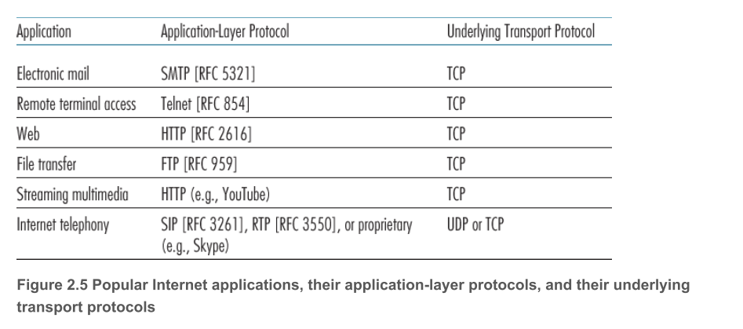
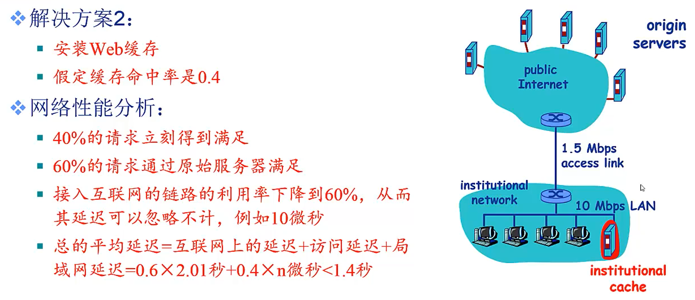
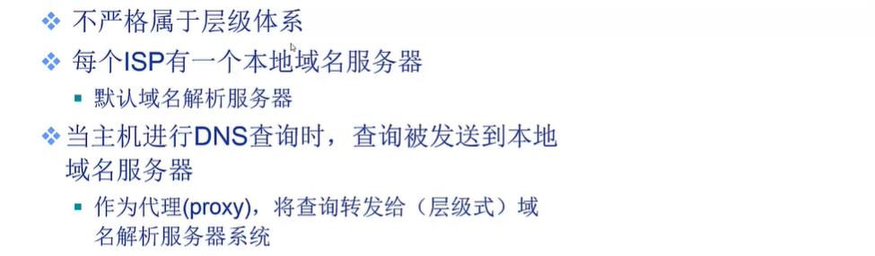

# 第一章 计算机网络和因特网

## 电路交换

电路交换: 传统的电路交换要求每个主机之间必须直接连接, 假设网络中有 $n$ 台主机, 就必须使用 $C_n^2$ 条链路, 十分浪费资源. 为了改进, 引入交换机, 让主机连入到交换机上, 通过交换技术实现两台主机的连接.

主机连接到交换机速率远远小于两个交换机之间的速率, 为了提高两个交换机之间链路的利用率, 引入多路复用技术, 实现多个主机同时连接到一个交换机上.
多路复用: 将网络资源划分为资源片, 将资源片分配给各路称之为 calls. 每个 call 独占资源片进行通信. 典型的多路复用技术: 频分多路复用, 时分多路复用, 波分多路复用, 码分多路复用.

- 频分多路复用FDM: 每个用户占用不同的宽带频率, 单位Hz. 用户得到一定的频率之后通信过程中始终占用该频率.
- 时分多路复用TDM: 将时间段划分为等长的时分复用帧, 每个用户占用固定序号的时隙. 各用户占用的时隙是周期性出现的.
- 波分多路复用WDM: 将不同的波长分配给不同的用户, 在光通信系统中常见.
- 码分复用CDM: 多用于无线通信网络, 为每个用户分配一个m比特的唯一码片序列. 用户使用相同频率的载波, 利用各自的码片序列编码数据. 编码信号=原始数据*码片序列. 对于一个用户, 他想要发送它的数据, 那么假如该数据是 0 , 则发送自己的 m比特的码片序列. 如果数据是 1, 就发送 m比特码片序列的补码.并且要求个用户的码片序列相互正交.

## 报文交换

报文: 应用(源)发送信息整体.

## 分组交换

每个ISP本身就是有多台分组交换机和多段通信链路组成的网络.  
IP协议定义了在路由器和端系统之间发送和接收的分组格式.  
Socket interface 规定了运行在一个端系统上的程序请求因特网基础设施向运行在另外一个端系统上的特定目的地程序交换数据的方式.  
在源和目的地之间, 每个分组都通过通信链路和分组交换机传送.  
交换机分为两种: 路由器和链路层交换机.  

分组: 报文拆分出来的一系列较小的数据包, 分组需要报文的拆分与重组, 会产生额外的开销.  
分组交换采用统计多路复用.  
分组交换的交换的特点:

- 存储转发传输: 与报文交换机能够开始向输出链路传输该分组的第一个比特之前, 必须接收到整个分组. 仅当路由器接收到所有分组之后才能向链路传输该分组. 通过 $N$ 条速率均为 $R$ 的链路组成的路径, 从源到目的地发送一个分组, 端到端的时延是 $d_{端到端}==N*L/R$
- 排队时延与分组丢失: 对于每条相连的链路, 该分组交换机有一个输出缓存(输出队列), 用于存储路由器准备发往那条链路的分组.  因此分组需要承受输出缓存的排队时延.
- 转发表和路由选择协议: 当源主机要向目的地端系统发送一个分组时, 源在该分组的首部包含了目的地的IP地址. 路由器有一个转发表, 用于将目的地址映射为输出链路, 路由器会根据分组的地址在转发表里面查找对应的输出链路.

分组交换与报文交换都是采用存储-转发交换方式. 报文交换以完整报文进行 "存储-转发", 分组交换以较小的分组进行 "存储-转发".  
  

**报文交换与分组交换的区别:**  
  
  
缓存大小至少要 7.5 mb.  
  
分组交换远远优越于报文交换.  

分组交换的报文交付时间:  
  

**分组交换与电路交换**
  

1. 分组交换更适合于突发式的数据网络传输.
   - 资源充分共享
   - 简单,无需呼叫建立
2. 可能产生拥塞现象: 分组延迟和丢失
   - 需要协议处理可靠数据传输和拥塞控制

## 计算机网络性能

速率: 单位时间内传输比特量, b/s, kb/s, Mb/s  
带宽: 原来指信号具有的频带宽度, 及最高频率个最低频率的差, 单位是Hz. 在网络中通常是数字信道所能传输的 "最高速率", 单位是 b/s.  
时延:  
为什么分组交换会发生丢包和时延?  
分组在路由器缓存中排队. 分组到达的速率远远超出输出链路容量, 分组排队,等待链路可用.  

四种分组延迟:

1. $d_{proc}$ 节点处理延迟
   1. 差错检测
   2. 确定输出链路
   3. 通常小于 msec
2. $d_{queue}$ 排队延迟
   1. 等待输出链路可用
   2. 取决于路由器的拥塞程度
3. $d_{trans}$ 传输延迟, 将所有分组推向链路的时间, $d_{trans}=L/R$
   1. L: 分组长度
   2. R: 链路带宽
4. $d_{prop}$ 传播延迟,链路的物理性质, $d_{prop}=d/s$
   1. d: 物理链路的长度
   2. s: 信号传播的速度

**排队延迟$d_{queue}$**  
R: 链路带宽  
L: 分组长度  
a: 平均分组到达的速率  
如果 $La/R$~0, 平均排队延迟很小.  
如果 $La/R$~1, 平均排队延迟很大.  
如果 $La/R$>1, 平均排队延迟无限大.

**时延带宽积 = 传播延时$d_{prop}$*带宽.** 得到的单位是 $bit$, 又被称为以比特为单位的链路长度.

分组丢失: 当路由器的队列缓存满了, 后来到达的包就会丢失.  

吞吐量: 发送端到接收端之间传送数据速率.在实际网络中, 吞吐量主要取决于瓶颈速率, 通常是主机到交换机或者链路速率  
即时吞吐量: 给定时刻的速率  
平均吞吐量: 一段时间内的平均速率  

## 计算机网络体系结构

  

## OSI 参考模型

  
  
  
  

**物理层的功能:**

- 接口特性
  - 机械特性, 电气特性..
- 比特编码
- 数据率
- 比特同步
  - 时钟同步
- 传输模式
  - 单工通信, 半双工, 双工

**数据链路层功能:**

- 负责结点-结点数据传输  
- 组帧  
- 物理寻址: 在帧头中增加发送端/接收端的物理地址标识数据帧的发送端/接收端
- 流量控制: 避免淹没接收端, 匹配发送速度和接收速度
- 差错控制: 检测并重传损坏或者丢失帧, 避免重复帧
- 接入控制(访问控制): 在某一时刻决定哪个设备拥有链路(物理介质)控制权

**网络层功能:**

- 负责源主机到目的主机数据分组的交付  
  - 可能跨越多个网络
- 逻辑寻址
  - 全局唯一逻辑地址, 确保数据分组被送到目的主机(IP地址)
- 路由
  - 路由器互联网络, 并路由分组到最终目的主机
  - 路径转发
- 分组转发

**传输层功能:**

  
负责源-目的(端-端)(进程之间)间完整报文传输.  

- 报文分段,重组
- SAP寻址
  - 确保将报文提交给正确进程, 如端口号  
    
- 连接控制
- 流量控制
- 差错控制

**会话层功能:**

  

- 对话控制
  - 建立,维护
- 同步
  - 在数据流中插入"同步点"
- 最薄的一层

**表示层功能:**

  
处理两个系统间交换信息的语法和语义问题

- 数据表示转化
  - 转化为主机独立的编码, 到达之后再转化为主机相关的编码
- 加密,解密
- 压缩,解压缩

**应用层功能:**

  
支持用户通过用户代理或者网络接口使用网络(服务)  
典型的网络应用:

- 文件传输 FTP
- 电子邮件 SMTP
- Web HTTP...

## TCP/IP 参考模型

  

**五层参考模型:**  
  
五层模型的数据封装  
  

## 课后习题

1. 与分组交换网络相比, 电路交换网络的优点? 以及TDM比FDM的优点?
   - 电路交换⽹络可以在响应时间内保证⼀定量的端到端带宽。如今⼤部分分组交换⽹络（包括因特⽹）⽆法保证端到端带宽。FDM需要复杂的模拟硬件来将信号转换为合适的频率。

2. 端到端的时延中组成成分中哪些时延是固定的?
   - 延迟组件包括处理延迟、 传输延迟、 传播延迟、 排队延迟。 除了排队延迟是变量其他的都是固定的。

3. 什么是应用层报文,传输层报文, 网络层报文, 链路层报文?
   - 应⽤层报⽂： 应⽤程序想发送和通过传输层的数据；
   - 传输层段： 由传输层⽣成并且封装有传输层头信息的应⽤层报⽂
   - ⽹络层数据段： 封装有⽹络层头信息的传输层段
   - 链路层帧： 封装有链路层头信息的⽹络层数据段

4. 路由器处理因特网协议栈中的哪写层次, 链路交换机处理的是哪些层次, 主机处理的是哪些层次?
   - 路由器处理⽹络、链路、物理层（第1到3层） 。（实际上现代路由器有时担任防⽕墙、缓存组件和处理传输层）链路层交换机处理链路层和⽹络层（第1到2层） 。 主机处理所有的五层。

# 第二章 应用层

## 应用层协议基础

现代应用程序采用的两种主流的网络体系结构: 客户-服务机体系结构, P2P对等体系.  
  

在一对进程之间的通信会话场景中, 发起通信的进程被称为客户, 在会话开始等待联系的进程是服务器.  
进程通过一个称为套接字 (Socket) 的软件接口向网络发送报文和从网络接收报文.  
Socket 是同一台主机内的应用层和传输层之间的接口.  
程序开发者对于传输层的控制仅限于: 1 选择传输层协议 2 也许可以设定几个传输层参数.  
主机由其 IP 地址标识. 端口号分配给主机内的应用程序.  

可供应用程序使用的传输服务: 可靠数据传输, 吞吐量, 定时, 安全性  

因特网(TCP/IP网络)提供的运输服务: UDP, TCP  

TCP服务模型包括**面向连接服务和可靠的数据传输服务**.  
  
TCP 的连接时全双工的, 即连接双方的进程可以在此连接上进行报文收发.  
TCP 协议还具有拥塞控制机制, 当接收方和发送方之间的网络出现拥堵时, TCP 的拥塞机制会抑制发送进程.  

由于 TCP和UDP 均无法提供加密机制, 信息安全无法保障, 因此业界研究出了 **安全套接字层(SSL)** 来保证数据安全. SSL 不是与 TCP/UDP 在相同层次下的第三种因特网运输协议, 而是对 TCP 的加强, 这种强化是在应用层实现的.

```text
发送端: 明文-> SSL -> TCP Socket -> 运输层
接收端: 加密数据 -> TCP Socket -> SSL -> 明文
```

UDP 提供最小服务, 属于不可靠连接, 进程通信之前没有握手过程. 也没有拥塞控制.  

常见的因特网应用的协议  
  

**应用层协议是网络应用的一部分**.

## Http

**HTTP概况**
HTTP 使用 TCP 作为它的支撑运输协议。 客户向它的 Socket 发送 Http请求报文 并从它的 Socket 接收 Http响应报文。  

服务器向客户发送请求的文件，而不存储任何关于该客户的状态信息。

**连接类型**
  

采用非持续性连接的HTTP的每个对象的传输时间 T 是 两次RTT时间(往返时间)+传输文件的时间. 如果有多个文件需要传输, 每个文件都需要T的时间, 效率低.  
  
采用持续性的HTTP连接: 在第一个文件传输完之后第二个文件还可以继续使用该连接, 不再需要 RTT 时间

**HTTP报文格式**
HTTP 请求

```html
GET /somedir/page.html HTTP/1.1
Host: www.someschool.edu
Connection: close
User-agent: Mozilla/5.0
Accept-language: fr
```


只有请求类型为 POST 时才会使用 Entity body。

HTTP 响应

```html
HTTP/1.1 200 OK
Connection: close
Date: Tue, 18 Aug 2015 15:44:04 GMT
Server: Apache/2.2.3 (CentOS)
Last-Modified: Tue, 18 Aug 2015 15:11:03 GMT
Content-Length: 6821
Content-Type: text/html
(data data data data data ...)
```


## Cookie 技术


## Web 缓存

  
  
实例, 假如不适用缓存技术  
  

优化  
  
  

条件 Get (Condition get) 的使用  
  

第一次访问页面：
Web Cache 代表一个请求浏览器， 向 Web Server 发出请求

```html
GET /fruit/kiwi.gif
HTTP/1.1 Host: www.exotiquecuisine.com
```

Web Server 向 Web cache 发送具有被请求对象的响应报文

```html
HTTP/1.1 200 OK
Date: Sat, 3 Oct 2015 15:39:29
Server: Apache/1.3.0 (Unix)
Last-Modified: Wed, 9 Sep 2015 09:23:24
Content-Type: image/gif
(data data data data data ...)
```

之后一段时间再访问：

Web cache 发送一个条件 Get 执行最新检查

```html
GET /fruit/kiwi.gif HTTP/1.1
Host: www.exotiquecuisine.com
If-modified-since: Wed, 9 Sep 2015 09:23:24
```

服务器检查：`If-modified-since` 恰好等于上次 response 的 `Last-Modified`. 于是服务器返回一个新的报文。 反之， 假如在 `If-modified-since` 晚于 `Last-Modified`， 则返回一个响应报文， 内容如下：

```html
HTTP/1.1 304 Not Modified
Date: Sat, 10 Oct 2015 15:39:29
Server: Apache/1.3.0 (Unix)
(empty entity body)
```

响应行中的 `304 Not Modified` 告诉缓存器可以使用该对象。

## Email 应用

### SMTP

因特网电子邮件系统由3个主要组成部分: 用户代理, 邮件服务器, 简单邮件传输协议(Simple Mail Transfer Protocol)  
  

SMTP邮件发送流程如下：  
  
  
SMTP 将邮件从发送方的用户代理传送到发送方的邮件服务器, 也将邮件从发送方的邮件服务器传送到接收方的邮件服务器.  

SMTP 协议：  
  

SMTP 实现发信  
  

SMTP 和 HTTP 的对比  
  

### EMail消息格式

Email 消息格式  
  
用MIME实现多媒体扩展：  
  

### 邮件访问协议

用户代理不能使用 SMTP 获得报文, 因为取报文是一个拉式操作, 而 SMTP 是一个推的协议, 因此我们需要设计一个特殊的邮件访问协议, 该协议将邮件服务器上的报文传送给用户本地, 目前流行的邮件访问协议包括第三版邮局协议 POP3, 因特网邮件访问协议 IMAP, HTTP.  

email 协议和 web 协议的不同，一个 email 应用可以组合性的使用使用多个协议。  
  

**POP3协议**
  
第三个阶段: 更新阶段, 在用户发出 quit 命令之后, 结束 pop3 会话. 这时邮件服务器删除那些被标价为删除的报文.  
  

**IMAP协议**
  

**基于 Web 的电子邮件**
用户和它的远程邮箱之间的通信通过 Http 进行, 但是它的邮件服务器和别人的邮件服务器之间发送和接收邮件任然是通过 SMTP 协议.

## DNS

### DNS 的作用

DNS： Domain Name System。DNS 协议运行在 UDP 上, 使用 53 端口. 
域名到 IP 地址的转换问题。  
域名解析系统：

- 多层命名服务器构成的分布式数据库
- 应用层协议： 完成名字的解析
  - Internet 的核心功能， 用应用层协议实现
  - 网络边界复杂

  

邮件服务器别名: MX 记录允许邮件服务器的Web服务器使用相同的主机名
负载均衡: 繁忙的站点往往不止一台服务器, 他们具有不同的IP地址, 用户给定域名, 负载均衡复杂分配用户请求到不同主机上.  

### DNS 的工作原理

分布式层次数据库：  
  
  

根域名服务器：
  

权威域名服务器：  


本地域名解析服务器：  
  

**查询过程：**  
迭代查询实例：  
  
递归查询实例：  
  

### DNS 缓存

DNS记录缓存和更新：  
  

### DNS 记录和报文

DNS记录:  
资源记录 RR 实现了主机名到IP的地址的映射, 每个DNS回答报文包含了一条或者多条资源记录.  
  
  
想要获得邮件服务器的规范主机名, DNS客户端应该请求一个MX记录, 为了获得其他服务器的规范主机名, DNS客户应该请求CNAME.  

如果一台DNS服务器是用于请求特定主机名的权威DNS服务器, 那么该DNS服务器将包含一条用于该主机名的A记录(假如该主机不是者主机名的权威服务器, 它还是有可能缓存该主机名到特定主机的A记录).
如果该服务器不是某主机名的权威服务器, 那么该服务器将包含一条NS记录, 和一条A记录. NS记录记录了包含特定主机名的域, A记录提供了NS记录中Value字段中的DNS的服务器IP地址.

DNS协议：  
  
  
  

域名注册：  
  
